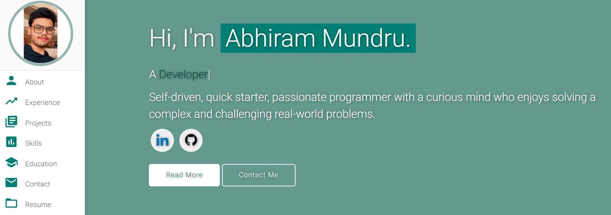

# Personal Portfolio ⚡️

> https://AbhiramMundru.github.io

### Website Preview

 
  <kbd>
    
  </kbd>

:star: Star me on GitHub — it helps!

## Sections 📚

✔️ About me\
✔️ Experience\
✔️ Projects \
✔️ Skills \
✔️ Education\
✔️ Contact Info\
✔️ Resume

To view a live example, **[click here](https://AbhiramMundru.github.io/)**

## Tools Used 🛠️

-   [<b>GitHub Pages</b>](https://create-react-app.dev/docs/deployment/#github-pages) - To host my static website (HTML, CSS, JS).
-   [<b>Materialize</b>](https://materializecss.com/) - A CSS framework to get Google's Material Design components.
-   [<b>Typed.js</b>](https://mattboldt.com/demos/typed-js/) - JavaScript Library

## Contributing 💡

#### Step 1

-   **Option 1**

    -   🍴 Fork this repo!

-   **Option 2**
    -   👯 Clone this repo to your local machine.

#### Step 2

-   **Build your code** 🔨🔨🔨

#### Step 3

-   🔃 Create a new pull request.

## License 📄

This project is licensed under the MIT License - see the [LICENSE.md](./LICENSE) file for details.
